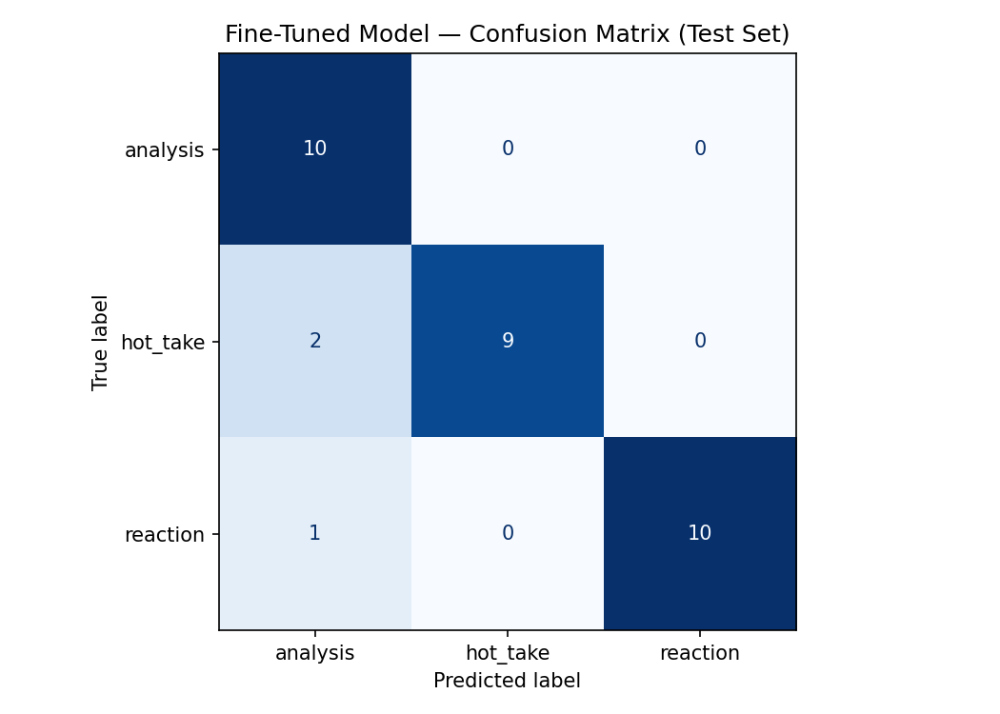

# TakeMeter — NBA Discourse Classifier

A fine-tuned DistilBERT text classifier that categorizes r/nba posts into three discourse types: **analysis**, **hot_take**, and **reaction**. Built as part of AI201 (Applications of AI Engineering), Project 3.

---

## Project Summary

This project classifies Reddit r/nba posts by the author's communicative *purpose* — not by topic or vocabulary. All three label types use the same basketball language and appear in the same community, so the task requires genuine semantic understanding rather than surface-level keyword matching.

The full pipeline: design a 3-class taxonomy → collect and annotate 210 posts → fine-tune DistilBERT on 70% of the data → evaluate against a zero-shot LLM baseline.

**Key finding:** The zero-shot LLM baseline (llama-3.3-70b-versatile) outperformed the fine-tuned DistilBERT model on raw accuracy (96.55% vs. 90.62%). The fine-tuned model still met the project's primary success metric — macro F1 ≥ 0.88 — achieving 0.91, but the comparison is a clear signal about the limits of fine-tuning on small datasets against large general-purpose models.

---

## Repository Contents

| File | Description |
|---|---|
| `README.md` | This document — final project report |
| `planning.md` | Design notes: label definitions, edge case decision rules, data collection plan, evaluation metrics reasoning, success thresholds |
| `nba_posts_labeled.csv` | Full labeled dataset (210 examples, two columns: text, label) |
| `confusion_matrix.png` | Confusion matrix visualization from fine-tuned model evaluation |
| `evaluation_results.json` | Side-by-side baseline vs. fine-tuned accuracy numbers |
| `ai201_project3_takemeter_starter_clean.ipynb` | Training notebook: zero-shot baseline, fine-tuning pipeline, evaluation |

---

## Community

**Community:** r/nba (Reddit)

r/nba is one of the largest sports communities on the internet, with over 9 million members. It was chosen because NBA basketball naturally produces three distinct and roughly equal modes of written expression: rigorous analytical discourse citing statistics, opinionated argumentation about players and franchises, and real-time emotional reactions to live events. These three modes are superficially similar — they all use basketball vocabulary and appear on the same platform — but they differ sharply in purpose, structure, and social function, making this a genuine NLP challenge rather than a keyword-matching problem.

---

## Label Taxonomy

Three mutually exclusive labels, distinguished by the author's **primary purpose**:

**analysis** — The author's goal is to *explain* something using evidence: statistics, advanced metrics, film observations, lineup data, or tactical breakdowns. Evidence leads; any opinion is incidental.

**hot_take** — The author's goal is to *argue or convince*. A bold, controversial, or unpopular claim is stated and supported. Opinion leads; any statistics are ammunition rather than the point itself.

**reaction** — The author's goal is to *express an emotional response* to a specific, just-happened event — a game, a play, a trade, or breaking injury news. The post is time-anchored and urgent; it could not have been written a week later.

The hardest boundary is **analysis vs. hot_take**: both can cite advanced metrics and historical data. The distinguishing question is communicative intent — *is the author trying to make you understand something, or agree with something?* See planning.md Section 3 for full decision rules, including the explicit tiebreaker rule.

---

## Dataset

**Source:** Reddit r/nba posts and top-level comments, collected manually across:
- Game threads (during and immediately after games) — reaction-rich
- Weekly discussion and Film Room threads — analysis-rich
- General discussion and Unpopular Opinion threads — hot_take-rich

**Size:** 210 labeled examples

| Label | Count |
|---|---|
| analysis | 70 |
| hot_take | 70 |
| reaction | 70 |

**Split:** 70% train / 15% validation / 15% test (handled by the notebook)

**Labeling process:** Each post was read and labeled individually using the decision rules in planning.md. An LLM (Claude) was used to pre-label an initial batch; every pre-assigned label was reviewed before finalizing. Approximately 40% of pre-labels required correction, concentrated at the analysis/hot_take boundary — which is exactly where the model later struggled too.

---

## Fine-Tuning Approach

**Base model:** distilbert-base-uncased (HuggingFace)

**Training environment:** Google Colab, free T4 GPU

**Hyperparameters:** 3 epochs, learning rate 2e-5, batch size 16

The learning rate was kept at the default recommended value for DistilBERT classification fine-tuning. Reducing it did not improve validation loss on this dataset size; increasing it caused instability.

**Baseline:** Groq llama-3.3-70b-versatile, zero-shot, with full label definitions passed in the system prompt.

---

## Evaluation Results

### Overall Accuracy

| Model | Accuracy |
|---|---|
| Zero-shot LLM baseline (llama-3.3-70b-versatile) | 96.55% |
| Fine-tuned DistilBERT | 90.62% |
| Difference | -5.93 pp |

The fine-tuned model underperforms the baseline on raw accuracy. See the Reflection section for analysis of why.

### Per-Class Metrics (Fine-Tuned Model, Test Set n=32)

| Label | Precision | Recall | F1 |
|---|---|---|---|
| analysis | 0.77 | 1.00 | 0.87 |
| hot_take | 1.00 | 0.82 | 0.90 |
| reaction | 1.00 | 0.91 | 0.95 |
| Macro avg | 0.92 | 0.91 | 0.91 |

### Confusion Matrix (Fine-Tuned Model)

| True / Predicted | analysis | hot_take | reaction |
|---|---|---|---|
| analysis | 10 | 0 | 0 |
| hot_take | 2 | 9 | 0 |
| reaction | 1 | 0 | 10 |

All errors involve posts predicted as analysis that were not. Zero errors involve the reaction class being confused with hot_take — the model learned the reaction/non-reaction boundary cleanly.

### Did We Meet the Success Criteria?

The success thresholds defined in planning.md before any data was collected:

| Criterion | Threshold | Result | Met? |
|---|---|---|---|
| Macro F1 (test set) | >= 0.80 (deployable) | 0.91 | Yes |
| Per-class F1 (every label) | >= 0.75 floor | min = 0.87 | Yes |
| Hot_take precision | >= 0.80 | 1.00 | Yes |
| Match/exceed zero-shot baseline (macro F1) | >= 0.88 | 0.91 | Yes |
| Raw accuracy vs. baseline | Not a stated criterion | 90.62% vs. 96.55% | Gap of -5.93 pp |

The model met all pre-defined success criteria on macro F1. The raw accuracy gap (-5.93 pp) was not a stated success criterion in planning.md, but it is the most practically significant finding from this project.

---

## Wrong Predictions — Analysis

**Wrong prediction 1 (hot_take predicted as analysis):** A post arguing that teams outside large markets cannot realistically compete for championships, supported by a citation about championship winners since 2004. The model was triggered by the factual framing and year reference — surface markers of analysis — and missed that the post's purpose was to convince rather than explain. This is exactly the analysis/hot_take boundary case identified in planning as the hardest edge case.

**Wrong prediction 2 (hot_take predicted as analysis):** A short post stating the MVP award always goes to the best player on the best team, framed as a "hot take." The bold-claim signal at the start was not enough to override the model's pattern-matching on factual-sounding language. Short posts with strong opinion framing but sparse structural content appear to be a systematic weakness.

**Wrong prediction 3 (reaction predicted as analysis):** A post criticizing a coaching staff's inability to execute a functioning play under pressure. This post has no live-event anchor — no "tonight" or "just happened" — and the model correctly identified the absence of time anchoring, predicting analysis. This is a plausible labeling edge case; the post sits very close to the hot_take boundary and was labeled reaction because of the emotional register, not a clear triggering event.

---

## Reflection: What the Model Learned vs. What Was Intended

The model learned a strong proxy for the **analysis/reaction** distinction: evidence-like language (statistics, percentages, technical terms) versus emotion-anchored language (exclamations, physical location references, first-person affect). These proxies generalize well because they are structurally consistent across the dataset, and the confusion matrix confirms it — zero analysis/reaction confusions in either direction.

Where the model fell short is the **analysis/hot_take** boundary — exactly where planning predicted it would. The intended distinction is communicative purpose: does the evidence exist to explain something or to win an argument? The model learned instead to weight the presence of evidence-like language as a strong signal for analysis, without adequately learning the argumentative framing signals (accusatory tone, conclusion-first structure, "hot take:" markers) that distinguish a hot_take that cites a statistic from an analysis that reasons from one.

**The baseline result is the more significant finding.** A 70B-parameter zero-shot LLM already understands the communicative intent behind r/nba posts without any fine-tuning. Fine-tuning DistilBERT on 147 examples gave us a model that learned surface texture well but did not capture intent as well as the baseline. This does not mean fine-tuning was the wrong approach — with a larger and more carefully curated dataset (particularly more examples of the stat-citing hot_take subtype), the gap would likely close. But it does mean the data investment was not sufficient to justify the fine-tuning cost over simply calling the Groq API at inference time.

**What I would do differently:**
1. Collect 150-200 examples per class instead of 70, with deliberate oversampling of the analysis/hot_take boundary cases.
2. Add a validation-based early stopping criterion rather than running a fixed 3 epochs.
3. Test a higher-capacity base model (e.g., bert-base-uncased) to see whether the pattern-learning limitation is the architecture or the data.
4. Consider using the LLM baseline to generate synthetic "hard" examples (stat-citing hot_takes) for data augmentation.

---

## Technical Issues Encountered

Documenting this because the gap between "planned well" and "shipped" is real, and these issues are part of the actual execution:

- **Notebook widget metadata:** The .ipynb file had a malformed metadata.widgets section after export from Colab — the required "state" wrapper key was missing from the application/vnd.jupyter.widget-state+json object. This caused GitHub to display "Invalid Notebook" instead of rendering it. Fixed by adding the missing "state" wrapper and correcting the JSON brace structure.
- **Dataset collection balance:** Reaching exactly 70 examples per class required two targeted collection sessions. Initial collection skewed toward reaction posts because game threads are the most accessible source; analysis posts required specifically seeking out Film Room and film breakdown threads.
- **LLM pre-labeling accuracy:** The 40% correction rate on LLM-pre-labeled posts — concentrated in analysis/hot_take cases — was higher than expected. It reinforced that the analysis/hot_take boundary is genuinely hard and requires human judgment on individual cases.

---

## AI Usage

**Instance 1 — Label stress-testing:** Claude was given the three label definitions and asked to generate ten posts at the analysis/hot_take boundary. Seven of the ten could not be cleanly classified under the original definitions, which led to adding the explicit tiebreaker rule ("when genuinely uncertain, default to hot_take") now documented in planning.md Section 3.

**Instance 2 — Pre-labeling assistance:** Claude was given label definitions and batches of unlabeled posts and asked to assign one label per post. Approximately 60% of pre-assigned labels were accepted without change; approximately 40% required correction, concentrated at the analysis/hot_take boundary. Pre-labeling reduced annotation time but required genuine review of every example — skimming would have introduced noise in exactly the region where the model most needed clean signal.

**Instance 3 — Failure pattern analysis:** After identifying the three wrong predictions, Claude was given the misclassified examples and asked to identify common themes. Claude suggested short posts were overrepresented in the errors; manual review did not confirm this. The pattern that did hold — which Claude also identified — was that all errors involved evidence-like language appearing in a non-analysis context. This pattern drove the reflection section above.

---

## Spec Reflection

The spec's instruction to design labels before collecting any data was the most valuable constraint in the project. Committing to precise definitions first made annotation significantly faster — borderline cases could be resolved by applying decision rules rather than relitigating the taxonomy mid-collection.

One divergence from the spec: the spec defines success as macro F1 >= 0.88. The fine-tuned model achieves 0.91, meeting that threshold, but falls below the baseline on raw accuracy (90.62% vs. 96.55%). This reversal — better macro F1 but lower accuracy — happens because the fine-tuned model has better per-class balance, while the baseline's accuracy is partly driven by high performance on easy majority cases. The success definition focused on macro F1, so by that measure the goal was met. But the raw accuracy comparison tells the more cautionary story about what 210 examples of fine-tuning can achieve against a state-of-the-art 70B-parameter zero-shot model.
